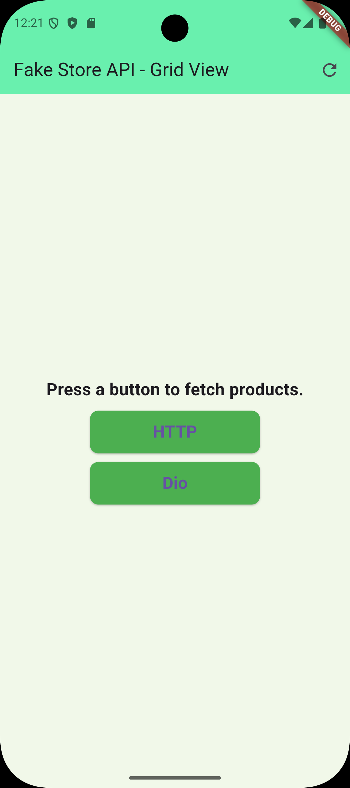
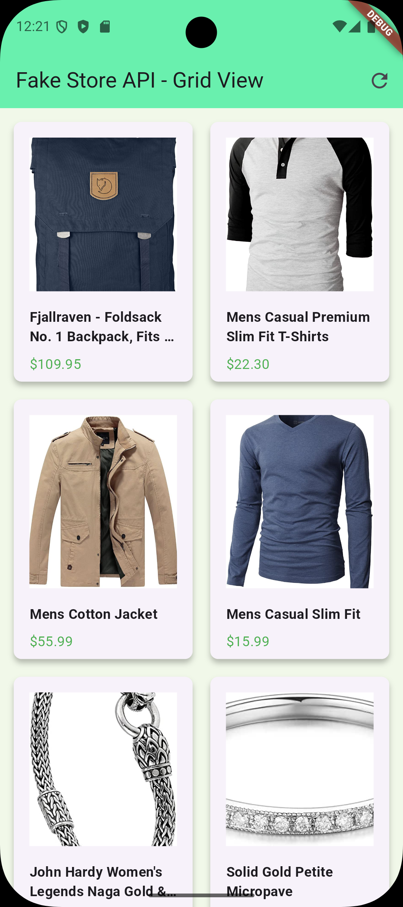

# **FakeStore API Integration - Flutter App**

This Flutter app fetches product data from the **FakeStore API** using both **HTTP** and **Dio** and displays it in a **grid view**.

---

## **Features**
- Fetches products using **http** or **dio**.
- Displays products in a **grid view** with **title**, **price**, and **image**.
- **BLoC** for state management (loading, success, error).

---

## **Libraries Used**
- **http**: For simple HTTP requests.
- **dio**: For advanced HTTP operations like interceptors.
- **flutter_bloc**: For managing state with BLoC.

---

## **App Features**
- **Grid View Display**: Products displayed in a 2-column grid.
- **Product Details**: Shows **title**, **price**, and **image**.
- **Toggle Between HTTP/Dio**: Buttons to switch data fetching methods.

---

## 📸 **Screenshots**

| **Home Screen (Buttons)**                    | **Home Screen (Dio)**                      | **Product**                         |
|-------------------------------------------|--------------------------------------------|-----------------------------------------|
|  |  |  |

- **Home Screen (Buttons):** Displays products fetched via the `http` package in a grid layout.
- **Home Screen (Dio):** Products are fetched using the `dio` package with enhanced network capabilities.
- **Products:** Showcases the error message when a request fails.

---

## **Code Overview**

### **API Services**

- **http** (`lib/services/api_service_http.dart`):
  Fetches product data using the `http` package.

- **dio** (`lib/services/api_service_dio.dart`):
  Fetches data with additional features (timeouts, retries).

### **BLoC** (`lib/blocs/my_feature/my_feature_bloc.dart`):
Handles loading, success, and error states when fetching data.

### **UI** (`lib/screens/my_screen.dart`):
Displays products in a **grid view** with product details.

---

## **Conclusion**
This app demonstrates how to fetch and display product data from **FakeStore API** using **http** and **Dio** in a **grid layout** with **BLoC** for state management.

---

### **License**
This project is licensed under the MIT License.
